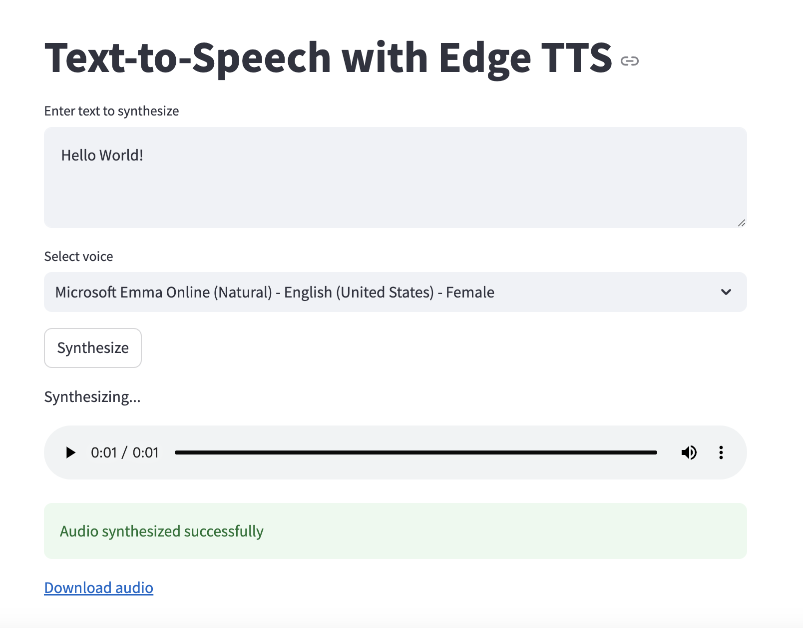

# A streamlit UI for edge-tts

# Install

This is simple streamlit UI wrapper for [edge-tts](https://github.com/rany2/edge-tts).

Install edge-tts:

    $ pip install edge-tts

Install streamlit:

    $ pip install streamlit

Run:

    $ streamlit run ui.py

Here is what it looks like:

